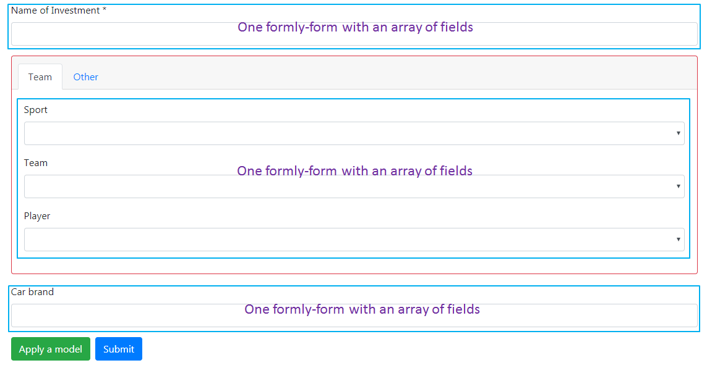
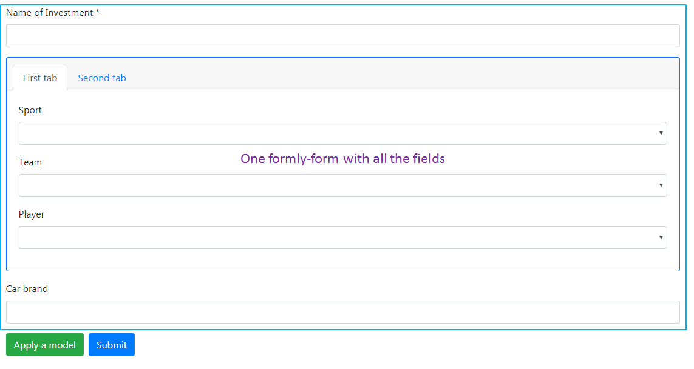

# Formly sandbox

[Demo on Stackblitz](https://stackblitz.com/github/Jukien/Formly-Sandbox)

## With multiple formly-form
To facilitate the positionning of fields we can use multiple formly-form (works only with **Formly 5.x**):

Here the tabs component is not include in a formly custom type. The layout and the fields of the form are separate.  
The layout design is out of the formly fields system.

## One formly-form and a tabs custom type
If we want all packed in, we need to create a custom type for the tabs component:

